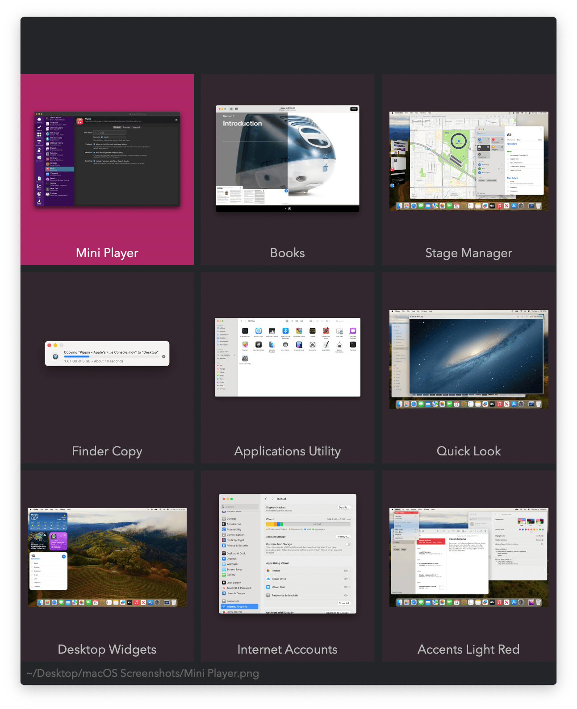
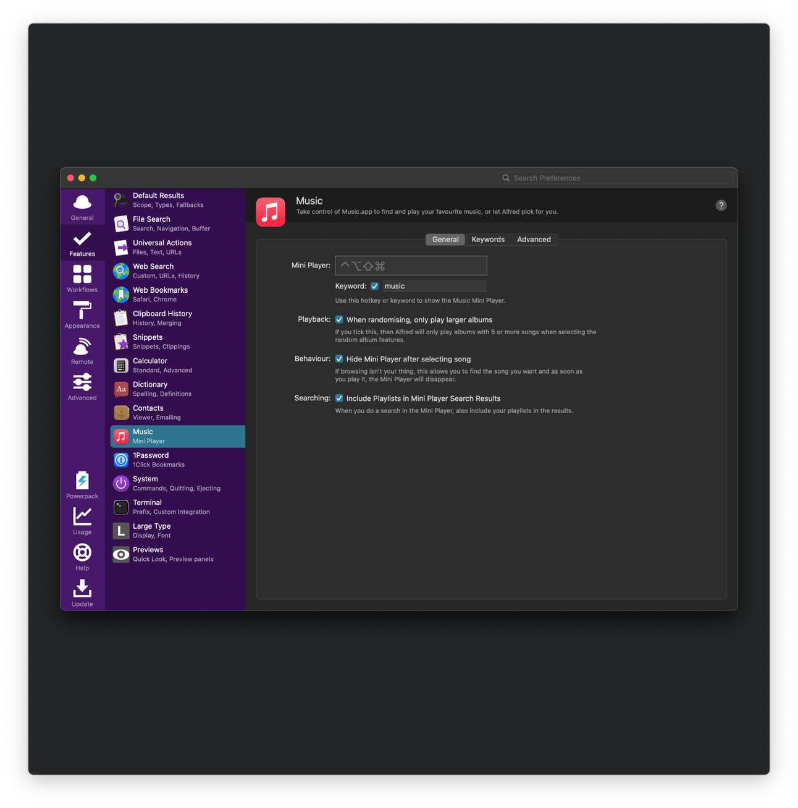
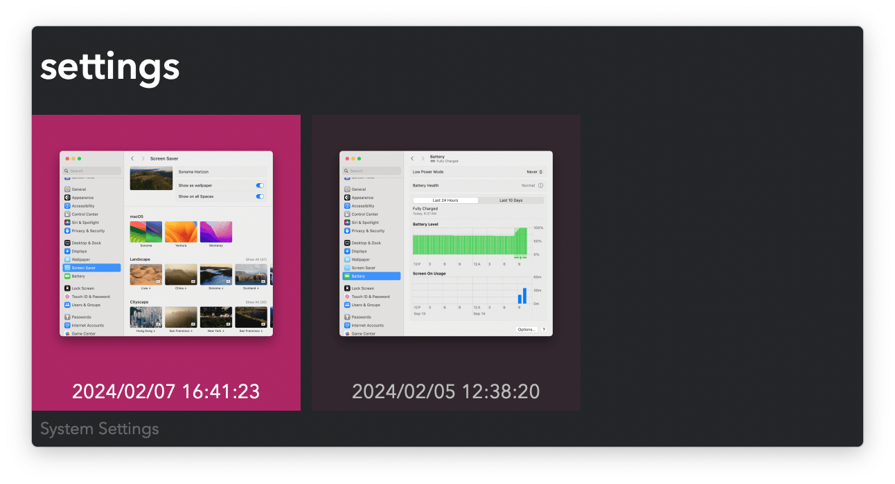
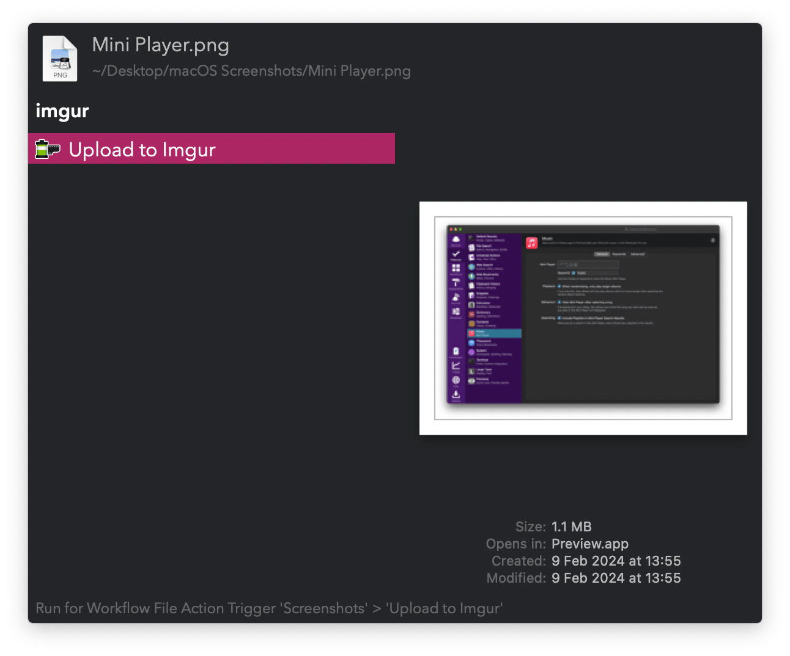

#  Screenshots Alfred Workflow

Search and act on screenshots

[⤓ Install on the Alfred Gallery](https://alfred.app/workflows/vitor/screenshots)

## Usage

Search screenshots via the `screenshots` keyword.

* <kbd>↩&#xFE0E;</kbd> View in Alfred.
* <kbd>⌘</kbd><kbd>↩&#xFE0E;</kbd> Copy to clipboard.
* <kbd>⌥</kbd><kbd>↩&#xFE0E;</kbd> Reveal in Finder.
* <kbd>⇧</kbd><kbd>↩&#xFE0E;</kbd> Upload to [Imgur](https://imgur.com).

* <kbd>↩&#xFE0E;</kbd> Show compatible apps for opening.
* <kbd>⌘</kbd><kbd>↩&#xFE0E;</kbd> Copy to clipboard.
* <kbd>⌥</kbd><kbd>↩&#xFE0E;</kbd> Reveal in Finder.
* <kbd>⇧</kbd><kbd>↩&#xFE0E;</kbd> Upload to [Imgur](https://imgur.com).
* <kbd>⎋</kbd> Return to Grid View.

View clipboard images via the `clipimg` keyword.

Take an interactive screenshot and upload it to Imgur via the `imgur` keyword.

Alternatively, upload any image with the [Universal Action](https://www.alfredapp.com/help/features/universal-actions/).

Configure the [Hotkeys](https://www.alfredapp.com/help/workflows/triggers/hotkey/) for faster triggering.
